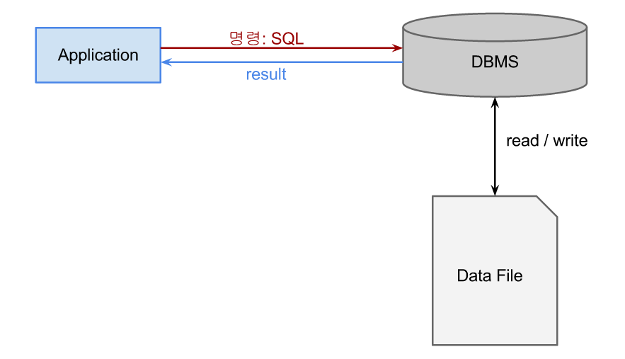
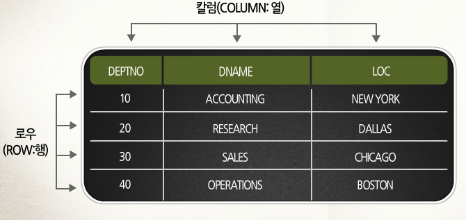
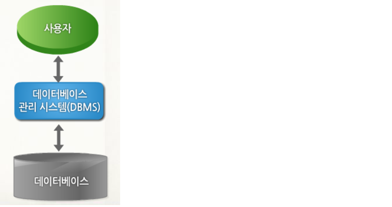

# 2. DBMS

- 데이터베이스를 관리하는 것이 DBMS이다.
    - 데이터 베이스 관리 시스템(DataBase Management System)
- 방대한 양의 데이터를 편리하게 저장하고 효율적으로 관리하고 검색할 수 있는 환경을 제공해주는 시스템 소프트 웨어
- 응용프로그램과 데이터베이스의 중재자로서 모든 응용프로그램들이 데이터베이스를 공용할 수 있게끔 관리해 주는 소프트웨어 시스템

**관계형 데이터베이스 관리 시스템(RDBMS : Relational Database Management System)의 종류**

- 오라클(Oracle)
- 사이베이스(Sybase)
- 인포믹스(infomix)
- MYSQL
- Acess
- SQL Server

**관계형 데이터 베이스는 정보를 저장하기위한 구조를 위해 테이블을 사용한다.**

**데이터 베이스 사용자**

- 사용자
    - 데이터베이스 관리자(DBA) : 데이터베이스 설계와 정의, 관리 및 운영 등 데이터베이스 시스템을 관리하고 제어하는 사용자
    - 응용프로그래머 : 데이터베이스를 실제적으로 설계하여 최종 사용자들의 요구에 맞는 인터페이스와 응용 프로그램을 개발
    - 최종 사용자: 데이터베이스를 실질적으로 사용하는 사용자